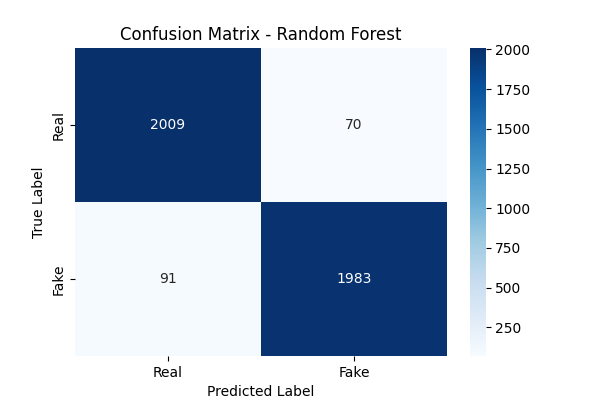

# Fake News Detection

## Project Summary
This project addresses fake news detection as a binary text classification problem using classical Natural Language Processing (NLP) techniques and supervised machine learning models. 

---

## Problem Definition
Given labeled news articles, the task is to classify each article as:
- **0** → Real news  
- **1** → Fake news  

The classification is based on article text content and associated metadata.

---

## Data Overview
- **Source:** Kaggle Fake News Dataset  
- **Input fields:** `title`, `author`, `text`  
- **Target:** `label` (binary: 0 real, 1 fake)

The text fields (`title`, `author`, `text`) are combined to form a single textual input for modeling.

---

## Methodology

### Text Preprocessing (NLP)
- Lowercasing  
- Removal of special characters and numbers  
- Tokenization  
- Stopword removal  
- Lemmatization  

### Feature Extraction
- **TF-IDF (Term Frequency–Inverse Document Frequency)** vectorization  
- Feature space limited to **10,000 terms** to control dimensionality

### Models Evaluated
- Logistic Regression  
- Multinomial Naive Bayes  
- Random Forest  

---

### Performance Summary

| Model | Accuracy | Precision | Recall | F1-Score | ROC-AUC |
|------|---------:|----------:|-------:|---------:|--------:|
| Logistic Regression | ~0.96 | ~0.95 | ~0.96 | ~0.96 | ~0.99 |
| Naive Bayes | ~0.90 | ~0.94 | ~0.87 | ~0.90 | ~0.97 |
| Random Forest | **~0.96** | **~0.97** | **~0.96** | **~0.96** | **~0.99** |

### Confusion Matrix (Random Forest)

---

## Key Takeaways
- TF-IDF features combined with classical ML models can achieve strong performance for fake news classification.
- Random Forest achieved the strongest overall results among the evaluated models.
- Logistic Regression remained a competitive and interpretable baseline.
- Comparing models using multiple metrics provides a more reliable evaluation than accuracy alone.

---

## Note

This project was developed as part of my Master of Data Science program, within the
Predictive Analytics for Business course.

## Contact
For any questions, please contact me:

- [LinkedIn](https://www.linkedin.com/in/mashael-alsogair-97b754230/)

Thank you!
